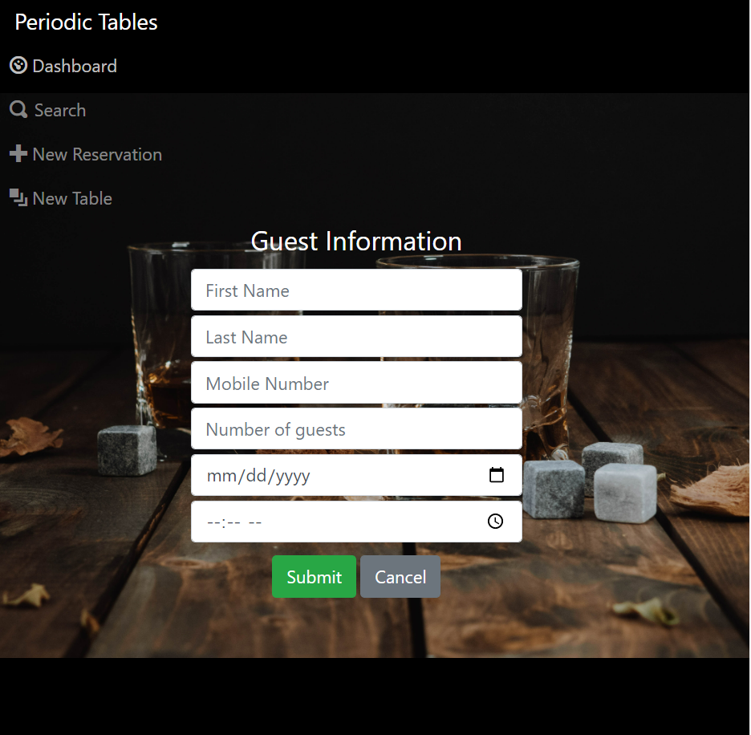

# Periodic Tables: Restaurant Reservation System

A reservation system meant to be used by restaurant personnel. Feel free to use this application to keep track, create, update and remove reservations, tables, and statuses.

## Demo

You can view the app here: 'https://reservation-client-rw.herokuapp.com/dashboard'

## Installation

1. Run `npm install` under the root folder to install project dependencies.
2. Run `npm run start:backend` to start your server.

## Features

### Dashboard

Each page displays a navigation list at the top right of the page (if on mobile, it is centered at top of page). Here you will find a link to the Dashboard, the Search page, the New Reservation page, and the New Table page.

The dashboard also displays the reservations for a chosen date, the restaurant tables, and navigation to change the date.

Each reservation listing displays the reservation time, the party name, the party amount, a contact number, the reservation status, and buttons to change the status, edit the reservation and cancel the reservation.

And each table listing includes the table name, id number, table capacity, and table status.

### Search Page

Upon clicking the search button, the user will be redirected to the Search Page. Here the user can input a phone number (can be partial) to return all reservations associated with that number.

### New Reservation Page

Upon clicking the new reservation button, the user will be redirected to a new screen to create a new guest reservation. This form includes inputs for first name, last name, contact number, party amount, date, and time.

The date must be in the future on operational days. The time must be during business hours up to an hour before closing.

Upon hitting submit, the user will be redirected to the dashboard page of the date of that reservation.

Note: The edit button on a reservation listing brings you to a similar page but with the reservations data already displayed in the input fields.

### New Table Page

Upon clicking the new table option the user will be prompted to a new screen where they can create a new table and submit it to be available for reservations:

Below the create table form is the list of tables so that the user can see which tables have already been created.

### Assign Table To Reservation Page

Upon clicking the "seat" button on a reservation card, the user will be redirected to a new screen. It will allow the user to assign this reservation a table. Upon hitting submit, the user will be redirected to the dashboard page of the date of that reservation.

Once the party at any table is done with their table the user can click the "finish" button to clear the table to be available for other reservations.

## Future Features

I have plans to provide the best user experience with extensive styling and additional features. If you would like to submit any feature requests or bugs, please head to the issues tab and I will be happy to review it.
